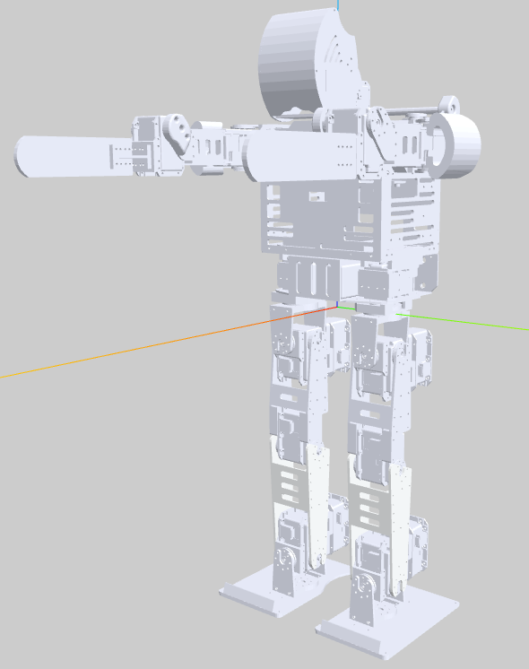
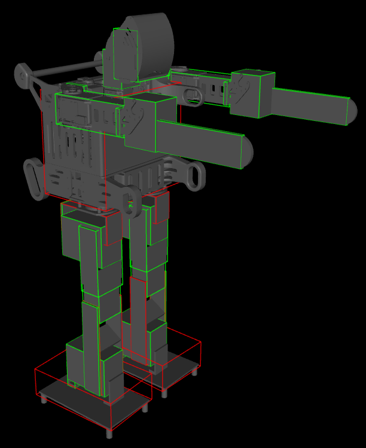

# Barelang Assets — URDF model (2025)

This repository contains the Barelang Robot models.

Instructions and Tips
- URDF Viewers that you can use:
  - https://gkjohnson.github.io/urdf-loaders/javascript/example/bundle/
  - On VSCode, You can use extension URDF Visualizer, etc.
- STL Viewers:
  MeshLab, FreeCAD, Mesh viewers, Blender. Meshlab instalation below:
  https://en.ubunlog.com/meshlab-install-this-3d-mesh-editor-on-ubuntu/

  Note: If you want to convert URDF to mjcf, simplify each STL. You can do this using MeshLab with 
  Filters->Remeshing, Simplification and Reconstruction->Simplification: Quadric Edge Collapse Decimation.

Note:
- Fix XML model barelangS
- Need to fix barelangK
